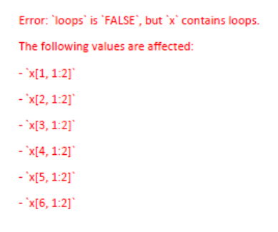

```{r setup, include=FALSE}
knitr::opts_chunk$set(echo = FALSE)
```


```{r echo=FALSE, results=FALSE}

library(ggplot2) 
library(readr) 
library(statnet)
library(ggraph)
library(tidyverse)
library(ergm)
library(dplyr)
library(corrr)
library(magrittr)
suppressWarnings(expr)

```

# Load Network Data

## Affiliation Matrix

Loading the dataset and creating the network to begin my analysis:

```{r code_folding=TRUE}
gd_affiliation <- read.csv('gd_affiliation_matrix.csv', row.names = 1, header = TRUE, check.names = FALSE)
gd_matrix <- as.matrix(gd_affiliation)
```

Inspecting the first 8 columns of the data structure in the affiliation matrix format: 

```{r code_folding=TRUE}
dim(gd_matrix)
gd_matrix[1:10, 1:4]
```

## Bipartite Projection

Now I can create the single mode network and examine the bipartite projection. After converting the matrix to a square adjacency matrix, I can look at the full matrix.

I can also call the adjacency matrix count for co-writing incidences between certain songwriters, such as between writing partners Jerry Garcia and Robert Hunter (78) and between John Barlow and Bob Weir (21).

```{r code_folding=TRUE}
gd_projection <- gd_matrix%*%t(gd_matrix)
dim(gd_projection)
gd_projection[1:10, 1:4]
gd_projection["Jerry Garcia", "Robert Hunter"]
gd_projection["John Barlow", "Bob Weir"]
```

# Statnet Network

Coercing directly from the original affiliation matrix kept giving the error, *"Error: `loops` is `FALSE`, but `x` contains loops."*, even when I give the appropriate arguments. I tried using the "intergraph" package to convert the network object created in igraph, but it cannot coerce bipartite igraph networks. 



After the bipartite projection, I was able to create the statnet network object.

```{r code_folding=TRUE}
set.seed(11)
gd_statnet <- as.network(gd_projection,
               directed = FALSE, 
               bipartite = FALSE,
               loops = FALSE,
               connected = FALSE)

network.stat<-network(gd_projection, directed=F, matrix.type="adjacency") 

```

## Network Features

Looking at the features of the statnet network with the appropriate commands

```{r echo=TRUE}

print(gd_statnet)

network::list.vertex.attributes(gd_statnet)
network::list.edge.attributes(gd_statnet)

gd_statnet

plot(gd_statnet)
```

## Dyad & Triad Census

Looking at the dyad/triad census info, I have a total of 2600 triads, which is in line with the results I got in igraph as well.

```{r echo=TRUE}

sna::dyad.census(gd_statnet)
sna::triad.census(gd_statnet)
sum(triad.census(gd_statnet))

```

## Transitivity

Looking next at the network transitivity, I can confirm that it is the same as the igraph network transitivity score of 0.5241. 

```{r code_folding=TRUE}
gtrans(gd_statnet)
```

## Geodesic Distance

Looking at the geodesic distance tells me that on average, I can confirm that the path length in statnet is 1.78, which is different than result from igraph of just over 2.

```{r code_folding=TRUE}
gd_gd <- geodist(gd_statnet,na.omit = TRUE, ignore.eval = TRUE, inf.replace = 0)
mean(gd_gd$gdist)

```

## Components

I can determine that there are 2 components in the statnet network object, they are - as in igraph - 25 songwriters in the large component and one isolate.

```{r echo=TRUE}

components(gd_statnet)
component.largest(gd_statnet)
```

## Density

In this case, the statnet output is far different from the igraph output of ~2.1, so I am not sure what is happening with this aspect of the calculation.

```{r code_folding=TRUE}
network.density(gd_statnet)
```

# Centrality

## Total Centrality

Calculating the total centrality degree as well as the "in-degree centrality" and "out-degree centrality" clearly uses a different scale than igraph. 

```{r code_folding=TRUE}
gd_stat_nodes <- data.frame(name=gd_statnet%v%"vertex.names",
    totdegree=sna::degree(gd_statnet),
    indegree=sna::degree(gd_statnet, cmode="indegree"),
    outdegree=sna::degree(gd_statnet, cmode="outdegree"))
rescaled_degree <- degree(gd_statnet, g=1, gmode="graph", 
        diag=FALSE, tmaxdev=FALSE, 
        cmode="freeman", rescale=TRUE)
gd_stat_nodes$rescaled <- rescaled_degree
#sort the top total degree of nodes in the stat network
arrange(gd_stat_nodes, desc(totdegree))%>%slice(1:5)
```

The statnet total degree scores are again, very different from igraph. In igraph, Jerry Garcia is the highest degree node, which makes sense given his position as the practical and figurative head of the band and the fact that he contributed to more songs than any other songwriter.  

Although in igraph's evaluation I was suprised that Jerry Garcia's songwriting partner Robert Hunter was ranked lower than Phil Lesh and Bob Weir, it seems that is also the case in the statnet evaluation.

I can understand how Bob Weir and Phil Lesh have high centrality despite lower song counts given their status as co-founding members of the band, it does not make sense to me knowing the context that they are ranked higher than Jerry Garcia.

## Closeness

```{r code_folding=TRUE}
#calculate closeness
close <- closeness(gd_statnet, gmode="graph")
#add to nodes data frame
gd_stat_nodes$closeness <- close
#sort the top total degree of nodes in the stat network
arrange(gd_stat_nodes, desc(closeness))%>%slice(1:5)
```

## Betweenness

```{r}
#calculate betweenness
between <- sna::betweenness(gd_statnet, gmode="graph")
#add to nodes data frame
gd_stat_nodes$betweenness <- between
#sort the top total degree of nodes in the stat network
arrange(gd_stat_nodes, desc(betweenness))%>%slice(1:5)

```

## Eigenvector Centrality

```{r}
#calculate eigenvector centrality
eigen <- sna::evcent(gd_statnet, gmode="graph")
#add to nodes data frame
gd_stat_nodes$eigenvector <- eigen
#sort the top total degree of nodes in the stat network
arrange(gd_stat_nodes, desc(eigenvector))%>%slice(1:5)
```

## Bonacich Power

```{r}
#calculate bonacich power
bonpow <- sna::bonpow(gd_statnet, gmode="graph")
#add to nodes data frame
gd_stat_nodes$bonacich <- bonpow
#sort the top total degree of nodes in the stat network
arrange(gd_stat_nodes, desc(bonacich))%>%slice(1:5)
```

### Add as Attributes

```{r code_folding=TRUE}

gd_statnet %v% "degree"<- degree(gd_statnet)       # Degree centrality
gd_statnet %v% "eigenvector"<- evcent(gd_statnet)       # Eigenvector centrality
gd_statnet %v% "closeness"<- closeness(gd_statnet)    # Closeness centrality
gd_statnet %v% "betweenness"<- betweenness(gd_statnet)  # Vertex betweenness centrality
gd_statnet %v% "bonacich"<- bonpow(gd_statnet) # Bonacich power
```

## Correlations of Centrality Measures

```{r code_folding=TRUE}
correlations <- gd_stat_nodes %>% 
  select(totdegree,eigenvector,betweenness,bonacich)%>%
  correlate() %>%
  rearrange()
fashion(correlations)
```

