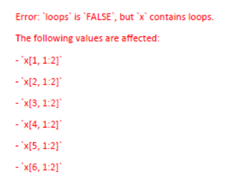

```{r setup, include=FALSE} 
knitr::opts_chunk$set(warning = FALSE, message = FALSE) 
```

# Network Details

## Background

For my project, I am using the Grateful Dead song writers data set that I used in [this series of posts](https://www.kristinabecvar.com/blog.html#category:grateful_network){target="_blank"} from my Social & Political Networks course to examine the network features of the co-writers of original Grateful Dead songs.

The data set consists of the links between co-writers of songs played by the Grateful Dead over their 30-year touring career that I compiled. 

There are 26 songwriters that contributed to the songs played over the course of the Grateful Dead history, resulting in 26 nodes in the dataset.

There are a total of 183 (updated and still under review!) unique songs played in the course of their touring career, and the various combinations of co-writing combinations are now represented in a binary affiliation matrix. 

I have considered using various measures as network weights, but in the end they have all been attributes and not weights. Unless there is a new metric that rises to the forefront of my analysis, this network will continue to be an unweighted, bipartite matrix. 

```{r echo=FALSE, results=FALSE}

library(ggplot2) 
library(readr) 
library(igraph)
library(statnet)
library(ggraph)
library(tidyverse)


suppressWarnings(expr)

```

## Affiliation Matrix

Loading the dataset and creating the network to begin my analysis:

```{r code_folding=TRUE}
gd_nodes <- read.csv('gd_nodes.csv', row.names = 1, header = TRUE, check.names = FALSE)
gd_affiliation <- read.csv('gd_affiliation_matrix.csv', row.names = 1, header = TRUE, check.names = FALSE)
gd_matrix <- as.matrix(gd_affiliation)
```

Inspecting the first 8 columns of the data structure in the affiliation matrix format: 

```{r code_folding=TRUE}
dim(gd_matrix)
gd_matrix[1:10, 1:4]
```

### Bipartite Projection

Now I can create the single mode network and examine the bipartite projection. After converting the matrix to a square adjacency matrix, I can look at the full matrix.

I can also call the adjacency matrix count for co-writing incidences between certain songwriters, such as between writing partners Jerry Garcia and Robert Hunter (78) and between John Barlow and Bob Weir (21).

```{r code_folding=TRUE}
gd_projection <- gd_matrix%*%t(gd_matrix)
dim(gd_projection)
gd_projection[1:10, 1:4]
gd_projection["Jerry Garcia", "Robert Hunter"]
gd_projection["John Barlow", "Bob Weir"]
```

### Igraph

Converting network data into igraph object using the "graph_from_incidence_matrix()" function gave me all songwriters and songs as total vertices. Graphing after the bipartite projection allowed a more accurate network.

```{r code_folding=TRUE}
set.seed(11)
#gd_igraph <- graph_from_incidence_matrix(gd_matrix, directed = FALSE)

gd_igraph <- graph.adjacency(gd_projection,mode="undirected") #igraph object

```

### Statnet

Coercing directly from the original affiliation matrix kept giving the error, *"Error: `loops` is `FALSE`, but `x` contains loops."* I tried using the "intergraph" package, but it cannot coerce bipartite igraph networks. 



After the bipartite projection, I was able to create the statnet object as well. I'll come back to that later.

```{r code_folding=TRUE}
set.seed(11)
#gd_statnet <- as.network(gd_affiliation,
               #directed = FALSE, 
               #bipartite = TRUE,
               #loops = FALSE)

#library(intergraph)
#gd_intergraph <- asNetwork(gd_igraph)
#print(gd_intergraph)

#detach("package:statnet")

gd_statnet <- network(gd_projection, directed=F, matrix.type="adjacency", bipartite = TRUE) #statnet object
```

## Network Analysis: IGraph

Now to check the vertices in the graph I've created to ensure they represent the data accurately, and confirm that all of the attributes have been represented properly (the graph is undirected, unweighted, and is bipartite):

```{r echo=TRUE}

head(V(gd_igraph)$name)
head(V(gd_igraph)$type)

is_directed(gd_igraph)
is_weighted(gd_igraph)
is_bipartite(gd_igraph)

igraph::vertex_attr_names(gd_igraph)
igraph::edge_attr_names(gd_igraph)

```

Next I want to take a first look at the network:

```{r code_folding=TRUE}

plot(gd_igraph)

```

### Igraph Triad Check

Knowing this network has 26 vertices, I want to see if the triad census is working correctly by comparing the following data, which I can confirm it is here!

```{r code_folding=TRUE}

#possible triads in network
26*25*24/6

sum(igraph::triad.census(gd_igraph))

```

### Igraph Transitivity

Looking next at the global v. average local transitivity of the network:

```{r code_folding=TRUE}

#get global clustering cofficient: igraph
transitivity(gd_igraph, type="global")
#get average local clustering coefficient: igraph
transitivity(gd_igraph, type="average")

```

This transitivity tells me that the average network transitivity is significantly higher than the global transitivity, indicating, from my still naive network knowledge, that the overall network is generally more loose, and that there is a more connected sub-network.

### Igraph Geodesic Distance

Looking at the geodesic distance tells me that on average, the path length is just over 2.

```{r code_folding=TRUE}

average.path.length(gd_igraph,directed=F)

```

### Igraph Components

Getting a look at the components of the network shows that there are 2 components in the network, and 25 of the 26 nodes make up the giant component with 1 isolate.

```{r code_folding=TRUE}

names(igraph::components(gd_igraph))
igraph::components(gd_igraph)$no 
igraph::components(gd_igraph)$csize

```

This is a great start - now I can get to looking at the network density, centrality, and centralization.

### Igraph Density

The network density measure: First with just the call "graph.density" and then with adding "loops=TRUE". Since I'm using igraph, I know that its' default output assumes that loops are not included but does not remove them, which can be corrected with the addition of "loops=TRUE" per the course tutorials when comparing output to statnet. This gives me confidence that my network density is closer to 2.1.

```{r code_folding=TRUE}

graph.density(gd_igraph)
graph.density(gd_igraph, loops=TRUE)

```
### Igraph Degree Measure

The network degree measure: This gives me a clear output showing the degree of each particular node (songwriter). It is not suprising, knowing my subject matter, that Jerry Garcia is the highest degree node in this network as the practical and figurative head of the band. The other band members' degree measures are not necessarily what I expected, though. I did not anticipate that his songwriting partner, Robert Hunter, would have a lower degree than band members Phil Lesh and Bob Weir. Further, I did not anticipate that the degree measure of band member 'Pigpen' would be so high given his early death in the first years of the band's touring life.

```{r code_folding=TRUE}

igraph::degree(gd_igraph)

```

To look further I will create a dataframe for easier review going forward.

```{r code_folding=TRUE}

grateful_igraph<-data.frame(name=V(gd_igraph)$name, degree=igraph::degree(gd_igraph))

grateful_igraph

```

### Igraph Summary Statistics

A quick look at the summary statistics confirms for me the minimum, maximum, median, and mean node degree data.

```{r code_folding=TRUE}

summary(grateful_igraph)

```

### Igraph Network Visualizations

Now I want to take a step back and try to visually represent this data better.

```{r code_folding=TRUE}

# Community detection algoritm 
community <- cluster_louvain(gd_igraph) 

# Attach communities to relevant vertices
V(gd_igraph)$color <- community$membership 

# Graph layout
layout <- layout.random(gd_igraph) 

# igraph plot 
plot(gd_igraph, layout = layout)

```

Better, but not quite.

```{r code_folding=TRUE}

ggraph(gd_igraph, layout = "fr") +
  geom_edge_link() + 
  geom_node_point(aes(color = factor(color))) + 
  geom_node_text(aes(label = name), repel = TRUE) +
  theme_void() +
  theme(legend.position = "none") 

```

That is starting to look more meaningful!

```{r echo=TRUE}

# Set size to degree centrality 
V(gd_igraph)$size = degree(grateful_igraph)

# Additional customisation for better legibility 
ggraph(gd_igraph, layout = "fr") +
  geom_edge_arc(strength = 0.2, width = 0.5, alpha = 0.15) + 
  geom_node_point(aes(size = size, color = factor(color))) + 
  geom_node_text(aes(label = name, size = size), repel = TRUE) +
  theme_void() +
  theme(legend.position = "none") 

```

### Igraph Centrality Measures

To examine the centrality and power scores of the nodes, I created a data frame with the centrality degree, normalized centrality, Bonacich power, Eigenvector centrality scores and the breakdown of reflected and derived centrality scores. I later added the closeness, betweenness, and Burt centrality scores.

To calculate the reflected and derived centrality scores, I first run some operations on the adjacency matrix and keep in mind that these two scores make up the entire calculation of the Eigenvector centrality score. 

```{r code_folding=TRUE}

gd_adjacency <- as.matrix(as_adjacency_matrix(gd_igraph))
gd_adjacency_2 <- gd_adjacency %*% gd_adjacency

#calculate Bonacich power
#bp_ig1 <- bonpow(gd_igraph) #with a default index of "1"

#calculate portion of reflected centrality
gd_reflective <- diag(as.matrix(gd_adjacency_2))/rowSums(as.matrix(gd_adjacency_2))
gd_reflective <- ifelse(is.nan(gd_reflective),0,gd_reflective)

#calculate derived centrality
gd_derived <- 1-diag(as.matrix(gd_adjacency_2))/rowSums(as.matrix(gd_adjacency_2))
gd_derived <- ifelse(is.nan(gd_derived),1,gd_derived)

#calculate closeness centrality: igraph
igraph::closeness(gd_igraph)

#calculate betweenness centrality: igraph
igraph::betweenness(gd_igraph, directed=FALSE)

#calculate Burt's network constraint
constraint(gd_igraph)

#I am loading the data frame of all of these values from previous pre-knitr runs

centrality_gd_igraph <- read.csv("centrality_df.csv")

row.names(centrality_gd_igraph)<-NULL
centrality_gd_igraph%>%
  arrange(desc(degree_all))%>%
  slice(1:5)

```

Right away, I see the highest degree are clearly Jerry Garcia and Robert Hunter, which makes sense given that they were a songwriting pair that were prolific in creating the Grateful Dead original songbook. Bob Weir also contributed quite a bit, though the songs he wrote with his writing partner John Barlow numbered many less than those that he wrote as part of the whole band, judging by Barlow's absence in the top counts.

The original lineup of Jerry Garcia, Bob Weir, Phil Lesh, Bill Kreutzmann, and Pigpen as well as Robert Hunter's presence in the formative years of the band's most collaborative era, means that this degree ranking makes sense intuitively.

#### Eigenvector Centrality

I am also interested in the Eigenvector centrality scores - Both the top as well as the lowest value scores.

```{r code_folding=TRUE}

centrality_gd_igraph%>%
  arrange(desc(EV_cent))%>%
  slice(1:5)

```

Robert Hunter having the top Eigenvector centrality score is not a shock - he has long held the unofficial title of band member and as the person behind the songwriting magic of the Grateful Dead. His primary songwriting partner was Jerry Garcia, but he also wrote songs with the early, full band and later with almost all of the individual members of the band.

It is a little surprising, though, that the Eigenvector scores fall off so quickly after Robert Hunter and Jerry Garcia.

#### Closeness

The closeness centrality of a node is defined as the sum of the geodesic distances between that node and all other nodes in a network. 

```{r, echo=TRUE}

centrality_gd_igraph%>%
  arrange(desc(close))%>%
  slice(1:5)

```

In addition to node-level centrality scores, I also want to calculate the network level centralization index for closeness centrality measures.  Again, I get a warning that closeness centrality is not well-defined for disconnected graphs.

```{r, echo=TRUE}

#calculate closeness centralization index: igraph
centr_clo(gd_igraph)$centralization

```

#### Betweenness

Betweenness represents the number of geodesics on which a node sits. 

Now I want to add the closeness and betweenness to my centrality data frame and first, sort by and take a look at the nodes with the highest betweenness:

```{r code_folding=TRUE}

row.names(centrality_gd_igraph)<-NULL
centrality_gd_igraph%>%
  arrange(desc(between))%>%
  slice(1:5)

```

The most immediate observations I have is that the highest degree node (Jerry Garcia) is not the node with the highest scoring betweenness. That goes to Bob Weir, who is still a relatively high degree node, but significantly lower than Jerry Garcia given that his betweenness score is so much higher (~121 compared to Garcia's ~16).

I can make a guess that the two highest degree nodes, Jerry Garcia and Robert Hunter, having relatively low betweenness scores can be linked to the fact that the two wrote mostly together. Although the pair wrote the most songs in the originals catalog, Bob Weir wrote many songs with a variety of other songwrriters; giving him a higher level of betweenness. 

Similarly, Phil Lesh and Pigpen, original band members who wrote relatively fewer songs, contributed to more songs that were written by the entire band, giving them more exposure to connections on the songs that they did write.

#### Top Closeness

Now a look at the top closeness scores:

```{r code_folding=TRUE}

centrality_gd_igraph %>%
  arrange(desc(close))%>%
  slice(1:5)

```

This evaluation is more difficult as the range is made up of much less clearly defined scores.

#### Network Constraint (Burt)

Constraint is a measure of the redundancy of a node’s connections. It is bound between 0 and 1, with 0 being a complete lack, and 1 being complete redundancy.

```{r code_folding=TRUE}

centrality_gd_igraph %>%
  arrange(desc(burt))%>%
  slice(1:5)

```

After all the closeness calculations, I saved the data frame for further analysis.

```{r code_folding=TRUE}
#centrality_gd_igraph <-data.frame(id=1:vcount(gd_network_ig),
                        #name=V(gd_network_ig)$name,
                        #degree_all=igraph::degree(gd_network_ig),
                        #degree_norm=igraph::degree(gd_network_ig,normalized=T),
                        #BC_power=power_centrality(gd_network_ig),
                        #EV_cent=centr_eigen(gd_network_ig,directed = F)$vector,
                        #reflect_EV=gd_reflective*centr_eigen(gd_network_ig,directed = F)$vector,
                        #derive_EV=gd_derived*centr_eigen(gd_network_ig,directed = F)$vector,
                        #close=closeness(gd_network_ig),
                        #between=betweenness(gd_network_ig, directed=FALSE),
                        #burt=constraint(gd_network_ig))

#write.csv(centrality_gd_igraph, file = "centrality_df.csv")

```

## Network Analysis: Statnet

How about the statnet object

```{r code_folding=TRUE}
print(gd_statnet)
```

### Statnet Attributes

Next, looking at the network basics. For some reason, statnet is recognizing the network as bipartite but it is listing the nodes from each sde of the projection, so they are listed twice.

```{r echo=TRUE}

#List network attributes: statnet

network::list.vertex.attributes(gd_statnet)
network::list.edge.attributes(gd_statnet)


head(gd_statnet %v% "na")
gd_statnet %v% "vertex.names"
head(gd_statnet %e% "LDC_topic")


```

### Statnet Dyad & Triad Census

```{r code_folding=TRUE}
#List network attributes: statnet

sna::dyad.census(gd_statnet)
sna::triad.census(gd_statnet)
```

### Statnet Transitivity

```{r code_folding=TRUE}
#network transitivity: statnet
gtrans(gd_statnet)
```

### Statnet Network Density

```{r code_folding=TRUE}

network.density(gd_statnet)

```

### Statnet Degree Summary

```{r code_folding=TRUE}

stat_nodes<-data.frame(name=gd_statnet%v%"vertex.names", degree=sna::degree(gd_statnet))
head(stat_nodes)

summary(stat_nodes)
```

### Statnet Evaluation

I'm not confident that the bipartite projection has led to an accurate network in the Statnet object. I wlil have to do further analysis and come back to the Statnet issue.


