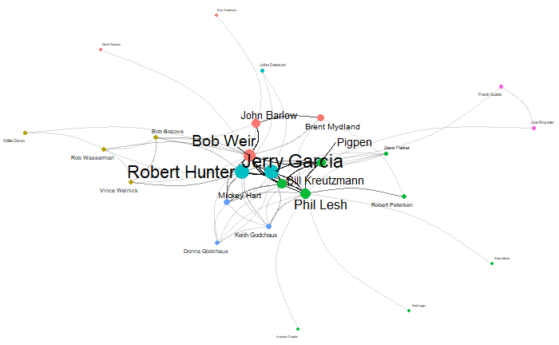

```{r setup, include=FALSE} 
knitr::opts_chunk$set(warning = FALSE, message = FALSE) 
```

# Network Details

## Background

For my project, I am using the Grateful Dead song writers data set that I used in [this series of posts](https://www.kristinabecvar.com/blog.html#category:grateful_network){target="_blank"} from my Social & Political Networks course to examine the network features of the co-writers of original Grateful Dead songs.

The data set consists of the links between co-writers of songs played by the Grateful Dead over their 30-year touring career that I compiled. 

There are 25 songwriters that contributed to the songs played over the course of the Grateful Dead history, resulting in 25 nodes in the dataset.

There are a total of 181 (updated and still under review!) unique songs played in the course of their touring career, and the various combinations of co-writing combinations are now represented in a binary affiliation matrix. 

I have considered using various measures as network weights, but in the end they have all been attributes and not weights. Unless there is a new metric that rises to the forefront of my analysis, this network will continue to begin analysis as an un-weighted, bipartite matrix. 

```{r echo=FALSE, results=FALSE}

library(ggplot2) 
library(readr) 
library(igraph)
library(ggraph)
library(tidyverse)
library(ergm)

suppressWarnings(expr)

```

## Affiliation Matrix

Loading the dataset and creating the network to begin my analysis:

```{r code_folding=TRUE}
gd_affiliation <- read.csv('gd_affiliation_matrix.csv', row.names = 1, header = TRUE, check.names = FALSE)
gd_matrix <- as.matrix(gd_affiliation)
```

Inspecting the first 8 columns of the data structure in the affiliation matrix format: 

```{r code_folding=TRUE}
dim(gd_matrix)
gd_matrix[1:10, 1:4]
```

### Bipartite Projection

Now I can create the single mode network and examine the bipartite projection. After converting the matrix to a square adjacency matrix, I can look at the full matrix.

I can also call the adjacency matrix count for co-writing incidences between certain songwriters, such as between writing partners Jerry Garcia and Robert Hunter (78) and between John Barlow and Bob Weir (21).

```{r code_folding=TRUE}
gd_projection <- gd_matrix%*%t(gd_matrix)
dim(gd_projection)
gd_projection[1:10, 1:4]
gd_projection["Jerry Garcia", "Robert Hunter"]
gd_projection["John Barlow", "Bob Weir"]
```

### igraph

#### From Incidence Matrix

Converting network data into igraph object using the "graph_from_incidence_matrix()" function gave me all songwriters and songs as total vertices. Graphing after the bipartite projection allowed a more accurate network.

```{r code_folding=TRUE}
set.seed(11)
gd_igraph_from_im <- graph_from_incidence_matrix(gd_affiliation, directed = FALSE)
```

#### From Adjacency Matrix

Converting network data into igraph object using the "graph_from_incidence_matrix()" function gave me all songwriters and songs as total vertices. Graphing after the bipartite projection allowed a more accurate network.

```{r code_folding=TRUE}
set.seed(11)
gd_igraph_adj <- graph.adjacency(gd_projection,mode="undirected")
```

## Network Analysis: igraph

Now to check the vertices in the graph I've created to ensure they represent the data accurately, and confirm that all of the attributes have been represented properly (the graph is undirected, unweighted, and is bipartite):

### From Incidence Matrix

```{r echo=TRUE}

head(V(gd_igraph_from_im)$name)
head(V(gd_igraph_from_im)$type)

is_directed(gd_igraph_from_im)
is_weighted(gd_igraph_from_im)
is_bipartite(gd_igraph_from_im)

igraph::vertex_attr_names(gd_igraph_from_im)
igraph::edge_attr_names(gd_igraph_from_im)

```

Graphing directly from the incidence matrix gives a bipartite network, but when visualizing the network it is not clear if this is the way I want to represent this data.

```{r code_folding = TRUE}
plot(gd_igraph_from_im, layout=layout.bipartite)
```

### From Adjacency Matrix (Bipartite Projection)

```{r echo=TRUE}
head(V(gd_igraph_adj)$name)
head(V(gd_igraph_adj)$type)

is_directed(gd_igraph_adj)
is_weighted(gd_igraph_adj)
is_bipartite(gd_igraph_adj)

igraph::vertex_attr_names(gd_igraph_adj)
igraph::edge_attr_names(gd_igraph_adj)
```

Graphing from the bipartite projection and using the graph from adjacency matrix function, I have a network of the songwriters only, but I need to do more digging to see if this is the best way to represent the data.

```{r code_folding=TRUE}
plot(gd_igraph_adj)
```

### Triad Check

Knowing this network has 25 vertices, I want to see if the triad census is working correctly by comparing the following data:

```{r code_folding=TRUE}

#possible triads in network
25*24*23/6

sum(igraph::triad.census(gd_igraph_from_im))

```

The igraph created from the incidence matrix is NOT representing the triad census properly.


```{r code_folding=TRUE}

#possible triads in network
25*24*23/6

sum(igraph::triad.census(gd_igraph_adj))

```

The igraph network created from the adjacency matrix is representing the triad census is working the way it should be.

### Transitivity

Looking next at the global v. average local transitivity of the network:

```{r code_folding=TRUE}

#get global clustering cofficient: igraph
transitivity(gd_igraph_from_im, type="global")
#get average local clustering coefficient: igraph
transitivity(gd_igraph_from_im, type="average")

```

This is another good sign that the correct choice is to graph from the adjacency matrix throug the bipartite projection going forward.

```{r code_folding=TRUE}

#get global clustering cofficient: igraph
transitivity(gd_igraph_adj, type="global")
#get average local clustering coefficient: igraph
transitivity(gd_igraph_adj, type="average")

```

This transitivity tells me that the average network transitivity is significantly higher than the global transitivity, indicating, from my still naive network knowledge, that the overall network is generally more loose, and that there is a more connected sub-network.

### Geodesic Distance

Looking at the geodesic distance tells me that on average, the path length is just over 2.

```{r code_folding=TRUE}

average.path.length(gd_igraph_adj,directed=F)

```

### Components

Getting a look at the components of the network shows that there are 2 components in the network, and 25 of the 26 nodes make up the giant component with 1 isolate.

```{r code_folding=TRUE}

names(igraph::components(gd_igraph_adj))
igraph::components(gd_igraph_adj)$no 
igraph::components(gd_igraph_adj)$csize

```

This is a great start - now I can get to looking at the network density, centrality, and centralization.

### Density

The network density measure: First with just the call "graph.density" and then with adding "loops=TRUE". Since I'm using igraph, I know that its' default output assumes that loops are not included but does not remove them, which can be corrected with the addition of "loops=TRUE" per the course tutorials when comparing output to statnet. This gives me confidence that my network density is closer to 2.26.

```{r code_folding=TRUE}

graph.density(gd_igraph_adj)
graph.density(gd_igraph_adj, loops=TRUE)

```
### Degree Measure

The network degree measure: This gives me a clear output showing the degree of each particular node (songwriter). I will also begin creating a dataframe for easier review going forward. 

It is not surprising, knowing my subject matter, that Jerry Garcia is the highest degree node in this network as the practical and figurative head of the band. The other band members' degree measures are not necessarily what I expected, though. I did not anticipate that his songwriting partner and key collaborator, Robert Hunter, would have a higher degree than band members Phil Lesh and Bob Weir. Further, I did not anticipate that the degree measure of band member 'Pigpen' would be so high given his early death in the first years of the band's touring life. Specifically, I'm surprised that Pigpen has a higher degree than John Barlow, who was the key collaborator and writing partner of Bob Weir. This tells me that the proportion of songs that Weir wrote outside of the songs written with Barlow were much more dramatic than the proportion of songs Garcia wrote outside the songs written with Hunter.

The original lineup of Jerry Garcia, Bob Weir, Phil Lesh, Bill Kreutzmann, and Pigpen as well as Robert Hunter's presence in the formative years of the band's most collaborative era, means that this degree ranking makes sense intuitively.

```{r code_folding=TRUE}
gd_ig_nodes<-data.frame(name=V(gd_igraph_adj)$name, degree=igraph::degree(gd_igraph_adj, loops = FALSE))
gd_ig_nodes$normalized <-igraph::degree(gd_igraph_adj, loops = FALSE, normalized = TRUE)

gd_ig_nodes%>%
  arrange(desc(degree))

```

### Summary Statistics

A quick look at the summary statistics confirms for me the minimum, maximum, median, and mean node degree data.

```{r code_folding=TRUE}

summary(gd_ig_nodes)

```

### Network Visualizations

Now I want to take a step back and try to visually represent this data better.

```{r code_folding=TRUE}
#ggraph(gd_igraph_adj, layout = "fr") +
  #geom_edge_link() + 
  #geom_node_point(aes(color = factor(color))) + 
  #geom_node_text(aes(label = name), repel = TRUE) +
  #theme_void() +
  #theme(legend.position = "none") 
```


That is starting to look more meaningful!

```{r code_folding=TRUE}

# Set size to degree centrality 
#V(gd_igraph_adj)$size = degree=igraph::degree(gd_igraph_adj)

#Additional customisation for better legibility 
#ggraph(gd_igraph_adj, layout = "fr") +
  #geom_edge_arc(strength = 0.2, width = 0.5, alpha = 0.15) + 
  #geom_node_point(aes(size = size, color = factor(color))) + 
  #geom_node_text(aes(label = name, size = size), repel = TRUE) +
  #theme_void() +
  #theme(legend.position = "none") 
```



### Centrality Measures

To examine additional centrality and power scores of the nodes, I added to the data frame with the centrality degree and normalized centrality. Now I am adding  Bonacich power, rescaled Bonacich power, Eigenvector centrality scores and the breakdown of reflected and derived centrality scores. Additionally, I am adding the closeness, betweenness, and Burt centrality scores.

To calculate the reflected and derived centrality scores, I first run some operations on the adjacency matrix and keep in mind that these two scores make up the entire calculation of the Eigenvector centrality score. 

```{r code_folding=TRUE}
#gd_adjacency <- as.matrix(as_adjacency_matrix(gd_igraph_adj))
#gd_adjacency_2 <- gd_adjacency %*% gd_adjacency

#calculate Bonacich power
#bp_ig1 <- power_centrality(gd_igraph_adj) #with a default index of "1"
#bp_ig2 <- power_centrality(gd_igraph_adj, rescale = TRUE) #rescaled so they sum to "1"

#calculate portion of reflected centrality
#gd_reflective <- diag(as.matrix(gd_adjacency_2))/rowSums(as.matrix(gd_adjacency_2))
#gd_reflective <- ifelse(is.nan(gd_reflective),0,gd_reflective)

#calculate derived centrality
#gd_derived <- 1-diag(as.matrix(gd_adjacency_2))/rowSums(as.matrix(gd_adjacency_2))
#gd_derived <- ifelse(is.nan(gd_derived),1,gd_derived)

#calculate closeness centrality: igraph
#close <- igraph::closeness(gd_igraph_adj)

#calculate betweenness centrality: igraph
#between <- igraph::betweenness(gd_igraph_adj, directed=FALSE)

#calculate Burt's network constraint
#constraint <- constraint(gd_igraph_adj)

#add these values to the data frame I started
#gd_ig_nodes$eigenvector <- eigen
#gd_ig_nodes$eigen_derived <- gd_derived
#gd_ig_nodes$eigen_reflective <- gd_reflective
#gd_ig_nodes$betweenness <- between
#gd_ig_nodes$closeness <- close
#gd_ig_nodes$bonacich <- bp_ig1
#gd_ig_nodes$bonacich_rescaled <- bp_ig2
#gd_ig_nodes$constraint <- constraint
#options(scipen = 999)

gd_ig_nodes<-read.csv("gd_ig_nodes.csv")
head(gd_ig_nodes[2:7])
```

#### Eigenvector Centrality

I am also interested in the Eigenvector centrality scores - Both the top as well as the lowest value scores.

```{r code_folding=TRUE}

gd_ig_nodes%>%
  arrange(desc(eigenvector))%>%
  slice(1:5)
```

Bob Weir having top overall Eigenvector centrality makes sense - he is a core founding member and a prolific songwriter. He did not write as many songs as Jerry Garcia or Robert Hunter, but he wrote with a larger variety of people.

The top derived Eigenvector centrality scores are songwriters who contributed to songs but were outside the band member or key collaborator circle, which again makes sense.

Robert Hunter having the top reflective Eigenvector centrality score is not a shock - he has long held the unofficial title of band member and as the person behind the songwriting magic of the Grateful Dead. His primary songwriting partner was Jerry Garcia, but he also wrote songs with the early, full band and later with almost all of the individual members of the band. 

#### Closeness

The closeness centrality of a node is defined as the sum of the geodesic distances between that node and all other nodes in a network. 

```{r code_folding=TRUE}
gd_ig_nodes%>%
  arrange(desc(closeness))%>%
  slice(1:5)
```

This evaluation is more difficult as the range is made up of much smaller scaled scores, but seem to be somewhat in line with the Eigenvector centrality scores.

In addition to node-level centrality scores, I also want to calculate the network level centralization index for closeness centrality measures. Here, I get a network level closeness measure of 0.552.

```{r, echo=TRUE}
#calculate closeness centralization index: igraph
centr_clo(gd_igraph_adj)$centralization
```

#### Betweenness

Betweenness represents the number of geodesics on which a node sits. 

Now I want to take the closeness and betweenness to my centrality data frame and first, sort by and take a look at the nodes with the highest betweenness:

```{r code_folding=TRUE}
gd_ig_nodes%>%
  arrange(desc(betweenness))%>%
  slice(1:5)
```

The most immediate observations I have is that the highest degree node (Jerry Garcia) is not the node with the highest scoring betweenness. That goes to Bob Weir, who is still a relatively high degree node, but significantly lower than Jerry Garcia given that his betweenness score is so much higher (~121 compared to Garcia's ~16).

I can make a guess that the two highest degree nodes, Jerry Garcia and Robert Hunter, having relatively low betweenness scores can be linked to the fact that the two wrote mostly together. Although the pair wrote the most songs in the originals catalog, Bob Weir wrote many songs with a variety of other songwriters, as suspected by the results in the degree scores. This would give him a higher level of betweenness. 

Similarly, Phil Lesh and Pigpen, original band members who wrote relatively fewer songs, contributed to more songs that were written by the entire band, giving them more exposure to connections on the songs that they did write.

#### Bonacich Power

Bonacich power is a bit complicated but I have taken away the concept that it measures how powerful a node is based on the relative strength or weakness of their alters. 

The lower, negative Bonacich power values imply that nodes become more powerful as their alters become weaker; positive Bonacich power values imply that nodes becomemore powerful as their alters become more powerful.

The cooperative songwriting network is likely not going to be a good example of this power compared to examining cooperative v. antagonistic relationships.

```{r code_folding=TRUE}
gd_ig_nodes%>%
  arrange(desc(bonacich))%>%
  slice(1:5)
```

#### Network Constraint (Burt)

Constraint is a measure of the redundancy of a node’s connections. It is bound between 0 and 1, with 0 being a complete lack of restraint, and 1 being complete redundancy.

```{r code_folding=TRUE}
gd_ig_nodes %>%
  select(name,constraint)
```

Similarly to the look at derived Eigenvector centrality, the highest network constraint scores go to songwriters that were relatively isolated in their contributions. However, beyond that, the results are very diverse in how they fall. The least constrained node, Bob Weir, is also the highest Eigenvector value as well as highest in betweenness. But second least constrained - Donna Godchaux - contributed to few songs, but most of them full-band collaborations, does indicate to me more of what this measure represents.


