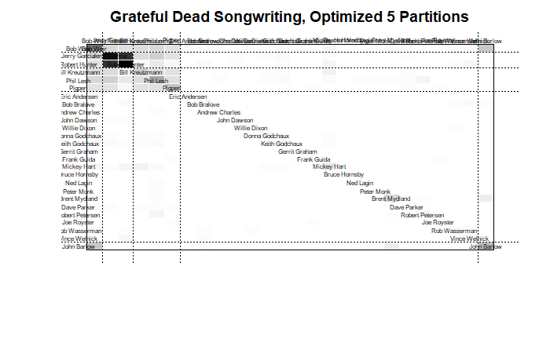
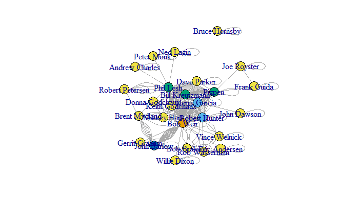

```{r setup, include=FALSE}
knitr::opts_chunk$set(echo = FALSE)
```

```{r echo=FALSE, results=FALSE}

library(ggplot2) 
library(readr) 
library(igraph)
library(ggraph)
library(tidyverse)
library(ergm)
library(dplyr)
library(corrr)
library(magrittr)

suppressWarnings(expr)

```

# Loading Network

I previously analyzed the network using igraph and statnet, and have found that igraph primarily serves the network best.

## Affiliation Matrix

Loading the dataset and creating the network to begin my analysis:

```{r code_folding=TRUE}
gd_affiliation <- read.csv('gd_affiliation_matrix.csv', row.names = 1, header = TRUE, check.names = FALSE)
gd_matrix <- as.matrix(gd_affiliation)
```

## Bipartite Projection

```{r code_folding=TRUE}
gd_projection <- gd_matrix%*%t(gd_matrix)
```

## From Adjacency Matrix

```{r code_folding=TRUE}
set.seed(11)
gd_igraph <- graph.adjacency(gd_projection,mode="undirected")
```

### Basic Visualization

```{r echo=FALSE}
set.seed(11)
net <- simplify(gd_igraph)
plot(gd_igraph, edge.size=.4, 
     edge.curved=.1,
     vertex.color="purple",
     vertex.frame.color="#555555",
     vertex.label.color="black", 
     vertex.label.cex=.7,
     vertex.label.dist=1,
     vertex.size=7,
     layout=layout_on_sphere)
```

# Loading Data

## Centrality Data

I am going to load the data frame I saved from my first igraph inspection here.

```{r code_folding=TRUE}
gd_centrality <- read.csv("centrality_df.csv")
head(gd_centrality)
```

## Correlations of Centrality Measures

```{r code_folding=TRUE}

correlations <- gd_centrality %>% 
  select(degree,eigenvector,bonacich, closeness, betweenness, constraint)%>%
  correlate() %>%
  rearrange()
fashion(correlations)
```
```{r code_folding=TRUE}
#visualize correlations
rplot(correlations)
```

## Blockmodeling

In my semester assignment posts, I looked more deeply into the role and blockmodeling of the network. In the end I was able to find a model that represents the network most intuitively - the optimized 5-partition blockmodel.

```{r echo=FALSE, eval=FALSE}
#select partitions with optimization
blks<-blockmodeling::optRandomParC(gd_projection, k=5, rep=10, approaches="ss", blocks="com")
#blockmodel with optimized partition
blk_mod <- blockmodel(gd_projection, blks$best$best1$clu, plabels=rownames(gd_projection)) 
#print blockmodel object
blk_mod$block.model
```



### Blockmodel Visualization

I can assign "block.membership" as a vertex attribute to my 5-partition blockmodel, then use the role attribute to change the color of plotted nodes in a network plot.

```{r code_folding=TRUE}

#V(gd_igraph)$role<-blk_mod$block.membership[match(V(gd_igraph)$name,blk_mod$plabels)]

#plot(gd_igraph, layout=layout_with_kk, vertex.color=V(gd_igraph)$role)
```

## Centrality by Network Role

I am changing the centrality table created earlier and adding the role assignments from the "blockmodel" calculations to summarize average node measures of centrality by role. This table is really becoming more of a 'node feature' data frame.

```{r code_folding=TRUE}
#attach role to centrality dataframe to create nodes dataframe
gd_nodes <- read.csv("gd_nodes.csv")
head(gd_nodes[10:16])
```

## Community

During the semester assignments, I investigated multiple community structures and the corresponding community scores. I'll load the matrix of community modularity scores first.

```{r code_folding = TRUE}
gd_mod <- read.csv("gd_mods.csv")
gd_mod
```

On inspection of the community structures created by each algorithm, I felt that the eigenvector community best represented the network. The modularity scores of the communities confirm that this is a reasonable observation. The higher modularity scores represent divisions with dense edge connections between the vertices within a community but sparse connections between vertices in different communities ()

### Eigenvector Community Detection

This method has created 5 communities to examine.

```{r code_folding=TRUE}
#Run clustering algorithm: leading eigenvector
eigen_gd <- leading.eigenvector.community(gd_igraph)
#Inspect community membership
igraph::groups(eigen_gd)
```

Igraph colors the nodes by community

```{r code_folding=TRUE}
#plot network with community coloring
plot(eigen_gd,gd_igraph)
```

### Louvain Community Clustering

One method I did not explore in the semester assignment was the Louvain clustering method. This method gives 7 communities that are somewhat unexpected, but give an interesting and valid perspective on the membership. The modularity of this method is 0.457, just above the modularity score of the eigenvector community modularity and very competitive as an option.

```{r code_folding=TRUE}
louvain <- cluster_louvain(gd_igraph)
louvain$modularity
plot(louvain,gd_igraph)
V(gd_igraph)$community <- louvain$membership

colrs <- adjustcolor( c("gray50", "tomato", "gold", "yellowgreen", "cornflowerblue", "orange"), alpha=.6)

plot(gd_igraph, vertex.color=colrs[V(gd_igraph)$community])
```

# Further Analysis

## K-core Decomposition

Finding the k-core where every node has degree of at least "k".

```{r}
kc <- coreness(gd_igraph, mode="all")
kc
#adding to the gd_nodes
gd_nodes$kcore<-kc
```


