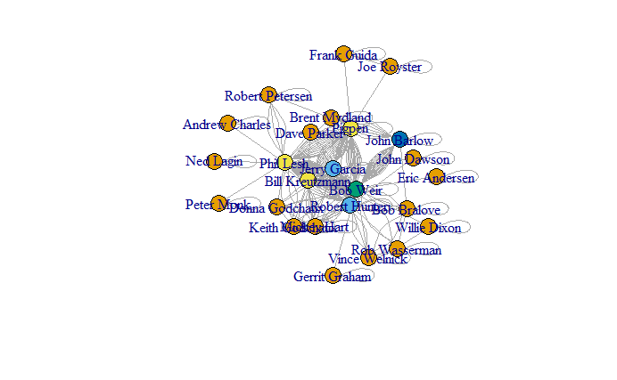

```{r setup, include=FALSE}
knitr::opts_chunk$set(echo = FALSE)
```

```{r echo=FALSE, results=FALSE}

library(ggplot2) 
library(readr) 
library(igraph)
library(statnet)
library(ggraph)
library(tidyverse)
library(ergm)
library(dplyr)
library(corrr)
library(magrittr)

suppressWarnings(expr)

```

# Loading Networks

I previously analyzed the network using igraph and statnet, and need to make a decision about which package serves the network best. 

## Affiliation Matrix

Loading the dataset and creating the network to begin my analysis:

```{r code_folding=TRUE}
gd_affiliation <- read.csv('gd_affiliation_matrix.csv', row.names = 1, header = TRUE, check.names = FALSE)
gd_matrix <- as.matrix(gd_affiliation)
```

## Bipartite Projection

```{r code_folding=TRUE}
gd_projection <- gd_matrix%*%t(gd_matrix)
write.csv(gd_projection, file = "gd_projection.csv")
```

## Create igraph Object

```{r code_folding=TRUE}
set.seed(11)
gd_igraph <- graph.adjacency(gd_projection,mode="undirected", weighted = NULL)
```

## Create statnet Object

```{r echo=FALSE}
set.seed(11)
gd_statnet <- as.network(gd_projection,
               directed = FALSE, 
               bipartite = FALSE,
               loops = FALSE,
               connected = TRUE)
```

# Loading Data

## Centrality and Node Data

I am going to load the data frame I saved from both igraph and statnet package analysis as well as a dataframe with key comparable results from each package

```{r code_folding=TRUE}
gd_ig_nodes <- read.csv("gd_ig_nodes.csv")
gd_stat_nodes <- read.csv("gd_stat_nodes.csv")
gd_compare <- read.csv("gd_comparison_packages.csv")
```

## Correlations of Centrality Measures

### Degree

```{r code_folding=TRUE}
degree_lm <- lm(igraph_degree~statnet_degree, data = gd_compare)
summary(degree_lm)
```

### Eigenvector Centrality

```{r code_folding=TRUE}
eigen_lm <- lm(ig_eigen~stat_eigen, data = gd_compare)
summary(eigen_lm)
```

### Betweenness

```{r code_folding=TRUE}
between_lm <- lm(ig_between~stat_between, data = gd_compare)
summary(between_lm)
```

### Closeness

```{r code_folding=TRUE}
close_lm <- lm(ig_close~stat_close, data = gd_compare)
summary(close_lm)
```

### Bonacich Power

```{r code_folding=TRUE}
bonpow_lm <- lm(ig_bonpow~stat_bonpow, data = gd_compare)
summary(bonpow_lm)
```

### Evaluation

There is high, nearly perfect in some cases, correlation in the scores given by the igraph and statnet packages in most measures. The largest differences are in the Bonacich power scores. The other difference, and most significant for my purposes, is the degree centrality scores. Although they are statistically correlated to a high degree, I have no independent way to verify which evaluation is "correct", so I will go forward using both networks depending on the needs of the task and capabilities of the packages.

## Structural Equivalence

Creating the matrix element then taking a look at the summary using the equivalence function "sedist", the default measure of assessing the approximate structural equivalence of actors, or "complete".

### "Complete"

```{r, code_folding=TRUE}
#calculate equivalence from specified distance marix
gd_stat_se<-equiv.clust(gd_statnet, equiv.fun="sedist", method="hamming",mode="graph")
```

```{r, code_folding=TRUE}
#summary of object produced by sedist()
#summary(gd_stat_se)
#plot equivalence clustering
plot(gd_stat_se,labels=gd_stat_se$glabels)
```

I need to look at the other methods of clustering as well. 

### "Average"

```{r code_folding=TRUE}
#with average cluster.method
gd_avg_se<-equiv.clust(gd_statnet, equiv.fun="sedist", cluster.method="average", method="hamming",mode="graph")
#plot:
plot(gd_avg_se,labels=gd_stat_se$glabels)
```

### "Single"

```{r code_folding=TRUE}

#with average cluster.method
gd_sing_se<-equiv.clust(gd_statnet, equiv.fun="sedist", cluster.method="single", method="hamming",mode="graph")

#plot:
plot(gd_sing_se,labels=gd_stat_se$glabels)

```

### "Ward.D"

```{r code_folding=TRUE}

#with average cluster.method
gd_wrd_se<-equiv.clust(gd_statnet, equiv.fun="sedist", cluster.method="ward.D", method="hamming",mode="graph")

#plot:
plot(gd_wrd_se,labels=gd_stat_se$glabels)

```

## Partition Using Clustering

I understand that the number of partitions (or roles) will depend on the height at which the dendrogram is cut. Using the tutorial example, I set the height at 15 and the result is 9 clusters. Using the alternate view from the tutorial, I also set the height at 10, and identify 10 distinct clusters.

### ward.D, Height= 15

```{r code_folding=TRUE}

#plot equivalence clustering
plot(gd_wrd_se,labels=gd_wrd_se$glabels)
#partition the clusters
rect.hclust(gd_wrd_se$cluster,h=15)
```

### ward.D, Height= 10

```{r code_folding=TRUE}

#plot equivalence clustering
plot(gd_wrd_se,labels=gd_wrd_se$glabels)
#partition the clusters
rect.hclust(gd_wrd_se$cluster,h=10)
```

### Height= 20

For my own experimenting, looking at it with a higher height ("20"), it spreads the clusters to 5.

```{r code_folding=TRUE}
#plot equivalence clustering
plot(gd_wrd_se,labels=gd_wrd_se$glabels)
#partition the clusters
rect.hclust(gd_wrd_se$cluster,h=20)
```

## Blockmodel Partitions

Inspecting the goodness of fit of the partitions that result from the clustering steps above using blockmodeling to try and get a better sense of how well the partitioning worked. Using the blockmodel command in statnet and specifying "k=x" means that "x" will indicate how many partitions to create, and "h=x" means that "x" will indicate the height to cut the dendogram.

### 2-partition blockmodel

```{r code_folding=TRUE}
#blockmodel and select partitions
blk_mod<-blockmodel(gd_statnet,gd_wrd_se,k=2)
#print blockmodel object
blk_mod
```

```{r code_folding=TRUE}
plot.block<-function(x=blk_mod, main=NULL, cex.lab=1){
  plot.sociomatrix(x$blocked.data, labels=list(x$plabels,x$plabels),
                   main=main, drawlines = FALSE, cex.lab=cex.lab)
  for (j in 2:length(x$plabels)) if (x$block.membership[j] !=
                                     x$block.membership[j-1]) 
    abline(v = j - 0.5, h = j - 0.5, lty = 3, xpd=FALSE)
}
plot.block(blk_mod,main="Grateful Dead Songwriting: 2 Partitions", cex.lab=.4)
```

### 5-partition blockmodel

```{r code_folding=TRUE}
#blockmodel and select partitions
blk_mod2<-blockmodel(gd_statnet, gd_wrd_se,k=5)
#print blockmodel object
blk_mod2$block.model
#plot blockmodel partitions
plot.block(blk_mod2,main="Grateful Dead Songwriting, 5 Partitions", cex.lab=.5)
```

### concoR-Based Partitions

```{r echo=FALSE}
library(concoR)
#select partitions with concor
concoR::concor_hca(list(gd_projection), p=2)
```

```{r code_folding=TRUE}
#select partitions with concor
blks<-concoR::concor_hca(list(gd_projection), p=2)
#blockmodel with concor
blk_mod <- blockmodel(gd_statnet, blks$block, plabels=blks$vertex) 
#plot blockmodel object
plot.block(blk_mod,main="Grateful Dead Songwriting, concoR 4 Partitions", cex.lab=.5)
```

## Blockmodeling Choice

In my semester assignment posts, I looked more deeply into the role and blockmodeling of the network. In the end I was able to find a model that represents the network most intuitively - the optimized 5-partition blockmodel.

```{r echo=FALSE, eval=FALSE}
#select partitions with optimization
blks3<-blockmodeling::optRandomParC(gd_projection, k=5, rep=10, approaches="ss", blocks="com")
#blockmodel with optimized partition
blk_mod3<-blockmodel(gd_projection, blks3$best$best1$clu, plabels=rownames(gd_projection)) 
#print blockmodel object
blk_mod3$block.model
plot.block(blk_mod3,main="Grateful Dead Songwriting, 5 Optimized Partitions", cex.lab=.5)
#I can assign "block.membership" as a vertex attribute to my 5-partition blockmodel for igraph
V(gd_igraph)$role<-blk_mod3$block.membership[match(V(gd_igraph)$name,blk_mod3$plabels)]
#and statnet
gd_statnet%v%"role"<-blk_mod3$block.membership[match(gd_statnet%v%"vertex.names", blk_mod3$plabels)]
#add to node dataframes
#attach role to centrality dataframe to create nodes dataframe
gd_stat_nodes$block <- blk_mod3$block.membership
gd_ig_nodes$block <- blk_mod3$block.membership
```

### Blockmodel Visualization

I can assign "block.membership" as a vertex attribute to my 5-partition blockmodel, then use the role attribute to change the color of plotted nodes in a network plot.

#### igraph

```{r code_folding=TRUE}
#plot(gd_igraph, layout=layout_with_kk, vertex.color=V(gd_igraph)$role)
```


#### statnet

```{r code_folding=TRUE}
#library(GGally)
#GGally::ggnet2(gd_statnet,
               #node.color="role", 
               #node.size=degree(gd_statnet, gmode="graph"),
               #node.label = "vertex.names",
               #node.alpha = .5)
```


## Community

### Fast and Greedy Community

The method attempts to detect dense sub-graphs by optimizing modularity scores on igraph networks that are un-directed. I'll start with inspecting the names that are part of the new object.

#### Simplify Function

The fast and greedy function was giving me an error code of:

*Error in cluster_fast_greedy(gd_network_ig):At fast_community.c:660:* *fast-greedy community finding works only on graphs without multiple* *edges, Invalid value*

Some community sourcing of opinions led me to run the "simplify()" function to correct this. And it did, during my semester assignment. But now, simplify() is simply not working. I'm not going too deep into this now, because frankly this community was the least intuitive when I ran it previously.

```{r code_folding=TRUE}
#create simplified igraph network
simple_gd <- simplify(gd_igraph)
#run fast_greedy clustering algorithm
#fg_gd <- cluster_fast_greedy(simple_gd)
is.simple(simple_gd)
```

### Walktrap Community Detection and Plot

The walktrap community detection created one community containing all of the songwriters in the giant component. I will not plot this community.

```{r code_folding=TRUE}
#Run clustering algorithm: walktrap
wt_gd <- walktrap.community(gd_igraph)
#Inspect community membership
igraph::groups(wt_gd)
```

### Collect & Compare Modularity Scores 

Saving the scores for evaluation and later analysis; I will continue to add the other community modularity scores into this vector as I run them.

```{r echo=TRUE}
mods<-c(walktrap=modularity(wt_gd))
mods
```

### Leading Label Propagation Community Detection

In this evaluation, each of the nodes was indicated to be in its' own community. I will not plot this community.

```{r code_folding=TRUE}
#Run clustering algorithm: leading label
lab_gd<-label.propagation.community(gd_igraph)
#Inspect community membership
igraph::groups(lab_gd)
#collect modularity scores to compare
mods<-c(mods, label=modularity(lab_gd))
```

### Edge Betweenness Community Detection

Again, each of the nodes was indicated to be in its' own community. I will not plot this community.

```{r code_folding=TRUE}
#Run clustering algorithm: edge betweenness
edge_gd <- label.propagation.community(gd_igraph)
#Inspect community membership
igraph::groups(edge_gd)
#collect modularity scores to compare
mods<-c(mods, edge=modularity(edge_gd))
```

### Eigenvector Community Detection

This method has created four communities to examine.

```{r code_folding=TRUE}
#Run clustering algorithm: leading eigenvector
eigen_gd <- leading.eigenvector.community(gd_igraph)
#Inspect community membership
igraph::groups(eigen_gd)
#collect modularity scores to compare
mods<-c(mods, eigen=modularity(eigen_gd))
```

igraph colors the nodes by community

```{r code_folding=TRUE}
#plot network with community coloring
plot(eigen_gd,gd_igraph)
```


## Spinglass Community Detection

This method has also created 4 communities to examine.

```{r code_folding=TRUE}
#Run clustering algorithm: spinglass
spin_gd <- spinglass.community(gd_igraph)
#Inspect community membership
igraph::groups(spin_gd)
#collect modularity scores to compare
mods<-c(mods, spin=modularity(spin_gd))
```

Again, igraph colors the nodes by community

```{r code_folding=TRUE}
#plot network with community coloring
plot(spin_gd,gd_igraph)
```

## Compare Community Partitions - Eigenvector and Spinglass

It would be worth comparing these scores on a weighted network in the future since it would take that into consideration. For now, I'm going to compare only the Eigenvector and Spinglass since those are the two community models that produced actual divisions.

```{r code_folding=TRUE}
#compare community partition modularity scores
modularity(eigen_gd)
```

```{r code_folding=TRUE}
#compare community partition modularity scores
modularity(spin_gd)
```

#### Variation Method

```{r code_folding=TRUE}
#compare community partitions using variation of information
compare(eigen_gd,spin_gd,method="vi")
```

#### Normalized Mutual Information Method

```{r code_folding=TRUE}
#compare community partitions
compare(eigen_gd,spin_gd,method="nmi")
```

#### Split Join Distance Method

```{r code_folding=TRUE}
#compare community partitions
compare(eigen_gd,spin_gd,method="split.join")
```

#### Rand Index Method

```{r code_folding=TRUE}
#compare community partitions
compare(eigen_gd,spin_gd,method="rand")
```

#### Adjusted Rand Index Method

```{r code_folding=TRUE}
#compare community partitions
compare(eigen_gd,spin_gd,method="adjusted.rand")
```

### Louvain Community Clustering

One method I did not explore in the semester assignment was the Louvain clustering method. This method gives 7 communities that are somewhat unexpected, but give an interesting and valid perspective on the membership. The modularity of this method is 0.455, just above the modularity score of the eigenvector community modularity and very competitive as an option.

```{r code_folding=TRUE}
louvain <- cluster_louvain(gd_igraph)
#collect modularity scores to compare
mods<-c(mods, louvain=modularity(louvain))
#Inspect community membership
igraph::groups(spin_gd)
```

visualizing the louvain community

```{r code_folding=TRUE}
plot(louvain,gd_igraph)
V(gd_igraph)$community <- louvain$membership
```
### Conclusion

On inspection of the community structures created by each algorithm, I felt that the louvain community best represented the network. The modularity scores of the communities confirm that this is a reasonable observation. The higher modularity scores represent divisions with dense edge connections between the vertices within a community but sparse connections between vertices in different communities.

A better visualization of this network with community membership

```{r code_folding=TRUE}
colrs <- adjustcolor( c("gray50", "tomato", "gold", "yellowgreen", "cornflowerblue", "orange"), alpha=.6)

plot(gd_igraph, vertex.color=colrs[V(gd_igraph)$community])
```

### Evaluation of Modularity

I am going to create a data frame to save with the modularity scores

```{r code_folding=TRUE}
gd_modularity <- c(mods)
gd_modularity <- as.data.frame(gd_modularity)
write.csv(gd_modularity, file = "gd_modularity.csv")
```

# Further Analysis

## Community Membership

Now that I have a community membership model that makes sense, I'll save it in the node data frames.

```{r code_folding=TRUE}
membership <- louvain$membership
membership
#adding to the gd_nodes
gd_ig_nodes$louvain<-membership
gd_stat_nodes$louvain<-membership
```

## K-core Decomposition

Finding the k-core where every node has degree of at least "k". I will add this so my node data frames before finishing up so I have that basic measure for furter analysis.

```{r code_folding=TRUE}
kc <- coreness(gd_igraph, mode="all")
kc
#adding to the gd_nodes
gd_ig_nodes$kcore<-kc
gd_stat_nodes$kcore<-kc
```


