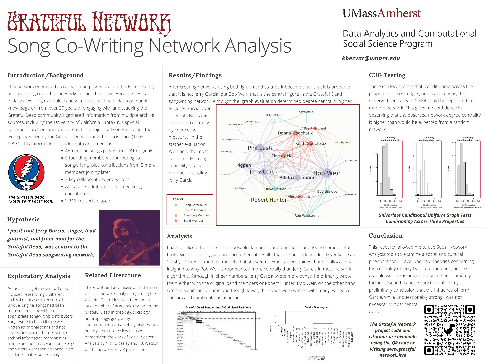

---
title: "Semester Summary"
description: |
  Wrap-Up of Preliminary Analysis
preview: poster.png   
categories:
  - network analytics
  - poster presentation
  - summary
author:
  - name: Kristina Becvar
    url: http://gratefulnetwork.live/
    affiliation: UMass DACSS Program (My Academic Blog Link)
    affiliation_url: https://kristinabecvar.com
date: 2022-05-11
output:
  distill::distill_article:
    toc: true
    code_folding: true

---  

```{r setup, include=FALSE}
knitr::opts_chunk$set(echo = FALSE)
```

There is much more to study with regard to the network of songwriters contributing to the Grateful Dead original song catalog. Beyond that, there is a world of research available on the larger social networks orbiting the Grateful Dead. 

For DACSS 697E, Social and Political Network Analysis, I feel confident I have gleaned the tools to begin scratching the surface of those networks. For a course summary, this project page and corresponding presentation poster serve as a representaton of that journey. I am grateful for this opportunity to explore this topic in new ways and plan to continue doing so in the future.




